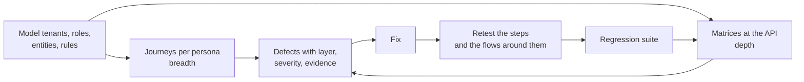

# Enterprise Multi-Tenant QA Matrix

Test matrices, checklists, and templates for QA of multi-tenant B2B SaaS: tenant isolation, roles and permissions, authentication and sessions, APIs, business rules, payments, regression, and AI workflows.

The most expensive defects in a shared SaaS system are rarely broken screens. They are boundary failures: one tenant reading another's records, a role performing another role's actions, a deactivated user still logged in, a payment that leaves the ledger wrong, or a UI that hides a button while the API still accepts the request. This repository is a structured way to look for those.

Created and maintained by Hira Ahmed.

## What is here

| Area | Guide | Reusable artifacts |
|---|---|---|
| Multi-tenant isolation | [docs/multi-tenancy](docs/multi-tenancy/README.md) | [tenant × role × action matrix](matrices/tenant-role-action.csv) |
| Roles and permissions (RBAC) | [docs/rbac](docs/rbac/README.md) | [endpoint × role × permission matrix](matrices/endpoint-role-permission.csv) |
| Authentication and sessions | [docs/authentication](docs/authentication/README.md) | [authentication state matrix](matrices/auth-state.csv) |
| Authorization | [docs/authorization](docs/authorization/README.md) | the two permission matrices above |
| API testing | [docs/api-testing](docs/api-testing/README.md) | [API negative-test checklist](checklists/api-negative-tests.md) |
| Test design: negative and boundary | [docs/test-design](docs/test-design/README.md) | [test case template](templates/test-case.md) |
| Business logic | [docs/business-logic](docs/business-logic/README.md) | [business-rule validation matrix](matrices/business-rules.csv) |
| Payments and reconciliation | [docs/payments](docs/payments/README.md) | [reconciliation checks](matrices/business-rules.csv) |
| Regression | [docs/regression](docs/regression/README.md) | [regression checklist](checklists/regression.md) |
| Exploratory testing | [docs/exploratory](docs/exploratory/README.md) | [session charter](templates/exploratory-charter.md) |
| AI agents and workflows | [docs/ai-workflows](docs/ai-workflows/README.md) | [AI workflow reliability checklist](checklists/ai-workflow-reliability.md) |
| Release | [pre-launch checklist](checklists/pre-launch.md) | [defect report](templates/defect-report.md), [QA summary report](templates/qa-summary-report.md) |

The [runnable example](examples/README.md) is a small API with deliberate defects, plus a probe that runs the endpoint permission matrix against it. It shows how a matrix becomes a repeatable test instead of a spreadsheet.

## How to use it

1. **Model the system first.** List tenants, roles, entities, and the actions that change state or money. The [multi-tenancy guide](docs/multi-tenancy/README.md#step-1-model-the-boundaries) walks through this.
2. **Copy the matrices** and replace the example rows with your own roles, endpoints, and rules. They are CSV so they work in a spreadsheet, a test runner, or a script.
3. **Run journeys for breadth, matrices for depth.** End-to-end journeys, run as each real persona, show whether the product works. The matrices, run against the API directly, show whether its boundaries hold.
4. **Record the layer of every defect** (frontend, backend, or both). A frontend-only fix for a backend defect leaves the hole open.
5. **Turn fixed defects into regression checks,** ideally as reproducible requests.

## Where this comes from

**Derived from my QA work.** The approach reflects how I have run QA on production B2B systems, including as Lead QA on a multi-tenant B2B distribution platform (PharmaConnect, described in my [public case study](https://hira299.github.io/case-studies/multitenant-saas-qa/)): journey-based coverage per persona, a role-by-action permission matrix, a frontend versus backend parity sweep, tenant isolation sweeps that check status codes, stored-data checks after every financial action, and classifying each defect by layer. Where a guide says "a pattern I have seen", it refers to a defect class described publicly in that case study, never to a specific ticket.

**Generalized.** Every matrix row, endpoint, role, and example in this repository is generic and written for this resource. None of it is a client's test case, schema, URL, or defect record. The example application is fictional.

## Principles

- Test what the API allows, not only what the UI shows.
- Check stored data after actions that change state or money; a correct screen can sit on top of an incorrect record.
- Every boundary needs a negative test: the request that should fail, sent by the actor who should not be able to make it.
- Report defects so they can be reproduced without you: the request, the response, what was stored, and what should have happened.
- Coverage should be visible. A filled matrix shows what was tested and, more usefully, what was not.

## Limitations

These resources structure testing; they do not replace understanding the product. A matrix only covers the rows someone thought to write, so pair it with exploratory sessions. The example rows are illustrative and will not match your system's roles or rules. Security-oriented checks here are the kind QA should run before release; they are not a substitute for a penetration test or a security review.

## Contributing

Corrections and additional checks are welcome, especially defect classes that the matrices miss. See [CONTRIBUTING.md](CONTRIBUTING.md).

## License

[MIT](LICENSE)

## About the author

Hira Ahmed, AI Engineer and AI Automation & QA Engineer. I build AI automation and LLM systems and test B2B SaaS platforms at their boundaries: tenants, roles, APIs, and money.

[Portfolio](https://hira299.github.io/) · [GitHub](https://github.com/hira299) · [LinkedIn](https://www.linkedin.com/in/hira-ahmed-4068402a7) · [Upwork](https://www.upwork.com/freelancers/~0178616a4e00b82166) · [Fiverr](https://www.fiverr.com/hira299)

Related: [n8n Production Resilience Patterns](https://github.com/hira299/n8n-production-resilience-patterns), reliability patterns for the workflow side of the same systems.
