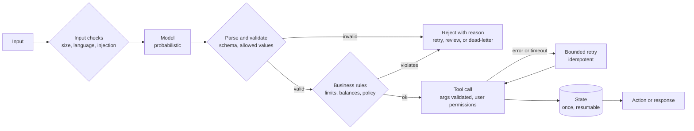

# Testing AI agents and workflows

An AI workflow combines a probabilistic component (the model) with deterministic ones (parsing, validation, tool calls, state, permissions, retries). The model's output cannot be made certain. The system around it can still be tested like any other software, and that is where most production failures actually are.

## Separate model failures from system failures

| Failure | Kind | Test it by |
|---|---|---|
| output in the wrong format | model, but handled by the system | feeding malformed outputs to the parser |
| output with wrong or missing fields | model, handled by validation | schema checks with invalid cases |
| plausible but wrong content | model | grounding checks, reviewers, domain rules |
| tool called with bad arguments | model, blocked by the system | argument validation, allow-lists |
| tool call fails or times out | system | fault injection at the tool |
| action repeated on retry | system | replaying the same trigger |
| state inconsistent after a failure | system | crashing the workflow at each step |
| agent acts outside its permissions | system | calling tools as a restricted user |

System failures are deterministic and testable to a high standard. Model failures are managed: detected, constrained, and routed, not eliminated.

## Where deterministic tests attach

Only the model box is probabilistic. Every diamond and every arrow out of it can be tested with fixed inputs and exact assertions.

## What to test

**Structured output.** Replace the model with fixed outputs and test the parser and validator against the common failure shapes: fenced JSON, a single object where a list is expected, truncated output, prose, wrong field names, wrong types, and values outside allowed sets. Each should be rejected with a reason, not crash the workflow.

**Tool calls.** For each tool the agent can call: invalid arguments, arguments that reference another tenant's data, a tool that errors, a tool that times out, and a tool that returns an unexpected shape. The agent's permissions should be the user's permissions, enforced by the tool, not by the prompt.

**Retries and duplicates.** Trigger the same event twice and retry after a failure. Actions with side effects (emails, records, payments) should happen once. Check for idempotency keys or claim-before-act ordering.

**State.** Stop the workflow after each step and restart it. It should resume or fail visibly, not skip or repeat work.

**Timeouts.** Slow model and tool responses: does the workflow time out, retry with backoff, and eventually route to a person?

**Authorization.** Prompts that ask for other users' data, other tenants' data, or admin actions. The expected result is a refusal by the tool layer, whatever the model decides.

**Input edge cases.** Empty input, very long input, other languages, instructions embedded in user content (prompt injection), and content that looks like the system's own markers.

**Business rules.** Model output that proposes something the business forbids (a discount above the limit, a refund above the balance) must be rejected by deterministic checks.

## Regression for AI workflows

- Keep a fixed set of inputs with known-good and known-bad outputs, including every failure that reached production.
- For deterministic parts, assert exact results.
- For model outputs, assert properties: valid schema, required fields present, values within allowed sets, no forbidden content, citations that resolve. Track pass rates over repeated runs rather than a single pass.
- Rerun the set when the prompt, model, model version, or tool definitions change.

## Observability

Log per run: input identifier, model and version, prompt version, raw output (truncated, with personal data removed), validation result and reasons, tool calls with arguments and results, retries, and the final action. Without this, a wrong result cannot be traced to the model, the prompt, the tool, or the code.

Use the [AI workflow reliability checklist](../../checklists/ai-workflow-reliability.md) before release. For implementation patterns on the workflow side (validation nodes, dead-letter queues, idempotency, replay), see [n8n Production Resilience Patterns](https://github.com/hira299/n8n-production-resilience-patterns).

## Limits

Testing can show that failures are detected and contained under the cases tested. It cannot show that a model will never produce a wrong answer. Report AI quality as measured rates on a defined test set, with the set described, not as a guarantee.
