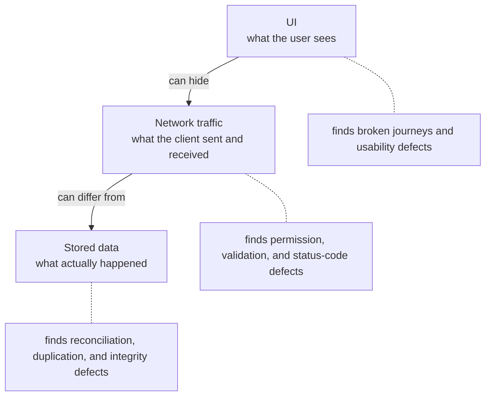

# API testing

The UI shows what the product wants a user to do. The API shows what it actually allows. For a B2B platform, most serious defects are only visible at this layer.



## Getting the API surface

- Record the browser's network traffic while running each journey. Every important action becomes a request you can replay and modify.
- Export requests as curl (browser DevTools: "Copy as cURL") and keep them with the test notes. They become the reproduction steps and, later, regression checks.
- Compare with API documentation or an OpenAPI file where one exists; undocumented endpoints are worth a look.

## What to check on every important request

| Check | Question |
|---|---|
| Authentication | Does it fail without a token, with an expired one, and with a revoked one? |
| Authorization | Does it fail for the wrong role, the wrong tenant, and the wrong owner? |
| Status code | Is it the agreed code, and consistent across similar endpoints? |
| Response body | Does it contain only fields this role should see? |
| Validation | Are missing, malformed, oversized, and extra fields rejected on the server? |
| Server-side computation | Are prices, totals, and permissions computed by the server, not taken from the request? |
| Stored result | Does the database (or a follow-up GET) match what the response claimed? |
| Idempotency | What happens if the same request is sent twice, or retried after a timeout? |
| Errors | Do failures return a useful message without internals (stack traces, SQL, other tenants' data)? |

The [API negative-test checklist](../../checklists/api-negative-tests.md) expands each row into specific requests.

## Reproducing with curl

A defect report with a runnable request saves the developer a round trip:

```bash
# As a user of tenant B, request an order that belongs to tenant A.
curl -s -o /dev/null -w "%{http_code}\n" \
  -H "Authorization: Bearer $TENANT_B_MANAGER_TOKEN" \
  "$BASE_URL/api/orders/$TENANT_A_ORDER_ID"
# Expected: 404. Actual: 403 (confirms the order exists).
```

Keep tokens and base URLs in environment variables, never in the report text.

## UI and API disagreements

Look for both directions:

- the UI blocks an action that the API accepts (a permission or validation defect)
- the UI shows success for a request the API rejected, or never sent (a silent failure)
- the UI shows values the API did not return (client-side computation that can drift from the server)

## After a fix

Rerun the saved request exactly, then the variations around it: other roles, other entities using the same endpoint pattern, and the bulk or export version of the same action. A fix is often applied to the one endpoint in the report and missed on its siblings.
