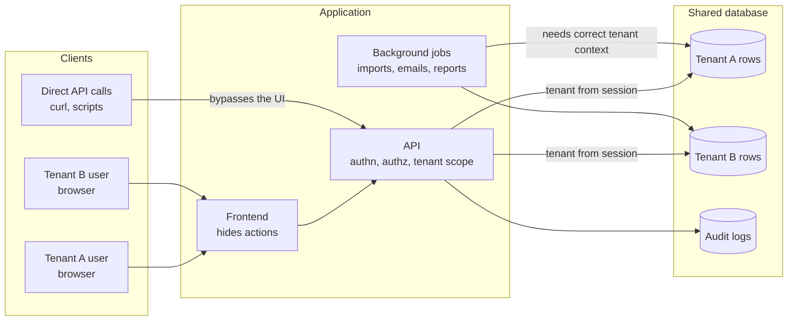

# Multi-tenant isolation testing

In a multi-tenant product, many customers share one application and usually one database. Isolation is enforced in code, on every query and every endpoint. One missed filter is enough for a tenant to read or change another tenant's data, and nothing in the UI will show it.

The API is the boundary that matters. Anything the UI enforces alone can be bypassed with a direct request.

## What can go wrong

| Failure | How it shows up |
|---|---|
| Missing tenant filter on a read | `GET /orders/{id}` returns another tenant's order when given its ID |
| Missing tenant check on a write | `PATCH /orders/{id}` or a bulk action changes another tenant's record |
| Tenant taken from the request | the server trusts a `tenant_id` in the body, query, or header instead of the session |
| Existence leak | another tenant's record returns 403 while a nonexistent one returns 404, so IDs can be enumerated |
| Leaky aggregates | dashboards, exports, search, autocomplete, or reports include other tenants' rows |
| Shared lookups | a "global" list (products, users, locations) exposes tenant-specific entries |
| Indirect references | a child record (invoice line, attachment, comment) is reachable through a parent from another tenant |
| Background jobs | imports, emails, or scheduled reports run with the wrong tenant context |
| Cross-tenant relationships | partnerships or invitations that legitimately link tenants and accidentally widen access |

The existence leak is easy to overlook because both responses deny access. It is still a finding: a pattern I have seen on a real platform was the API returning "forbidden" for another tenant's orders, which confirms the record exists. Returning 404 for "not yours" and "does not exist" alike removes that signal.

## Step 1: model the boundaries

Before testing, write down:

- **Tenants:** at least two, set up identically, so every test has a victim and an attacker with the same role. Three is better when the product has tenant-to-tenant relationships (partner, supplier, reseller).
- **Roles within each tenant,** plus platform-level roles (support, super admin) and unauthenticated visitors.
- **Entities** and which ones are tenant-owned, shared, or global.
- **Actions** per entity: read, list, create, update, delete, and any state-changing or money-moving action (approve, dispatch, refund, export).
- **How the tenant is determined** for each request: session, subdomain, path, header, or body. Anything the client can set is a test target.

## Step 2: build the matrix

Use [tenant × role × action](../../matrices/tenant-role-action.csv). Each row states who acts, on which tenant's data, what they try, and what should happen. The core rows are the same for every entity:

- same tenant, allowed role: succeeds
- same tenant, disallowed role: denied (403)
- other tenant, any role: not found (404), and no data in the response
- other tenant, list or search: the other tenant's rows are absent
- unauthenticated: 401

## Step 3: execute at the API

The UI will not let you ask for another tenant's record, so isolation has to be tested with direct requests.

1. As tenant A, create a record and note its ID.
2. As tenant B, with each role, request that ID through every endpoint that accepts it: detail, update, delete, child collections, exports, and action endpoints.
3. Try the variations: IDs in the path, query, and body; bulk endpoints with a mix of own and foreign IDs; filters such as `?tenant_id=` or `?distributor=`.
4. Check the response code, the body, and the headers. Then check the stored data: a "failed" request that still wrote something is a finding.
5. Repeat for list, search, export, and report endpoints, and look for tenant A's records in tenant B's results.

A sweep across every entity type, not only the obvious ones, is where the less visible leaks turn up.

## Step 4: check the side channels

- Error messages that include another tenant's names or values
- Sequential or guessable IDs combined with any existence leak
- File and attachment URLs that work without a session
- Notifications and emails sent to the wrong tenant's users
- Caches keyed without the tenant
- Audit and activity logs visible across tenants

## Reporting

Isolation defects are usually high severity even when the leaked data looks harmless, because the same missing check typically applies to more sensitive entities. Include both tenants, the role, the exact request, the response, and whether data was read, changed, or only confirmed to exist. Use the [defect template](../../templates/defect-report.md).
