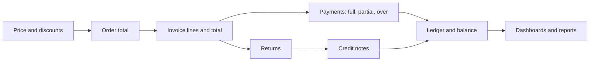

# Payments and reconciliation testing

Money defects compound. An overpayment accepted today corrupts the invoice total, the revenue report, and the next statement. Testing payments means following money through every stage and checking that the totals agree at each one.

## Model the money flow

Draw the stages for your product, for example:

Every arrow is a place where a total can drift. Every node needs a check.

## Invariants to test

| Invariant | Check after |
|---|---|
| invoice total = sum of lines | invoice creation, edit, cancel and recreate |
| outstanding = total − payments − credits | every payment and credit note |
| outstanding never goes below zero | overpayment, duplicate payment, concurrent payments |
| credited quantity ≤ delivered quantity | returns and credit notes |
| each order is invoiced once | re-batching, retries, cancelled batches |
| report totals = sum of records | every day-end or dashboard view |
| currency and rounding are consistent | line-level versus total-level rounding |

## Scenarios

**Partial settlement.** Pay an invoice in three parts. After each, check the outstanding balance, the status (unpaid, partially paid, paid), and the ledger entries. Then try a fourth payment.

**Overpayment.** Pay one cent more than the outstanding balance, then the exact balance twice. A pattern I have seen: payments exceeding the balance were accepted and corrupted invoice and revenue totals.

**Duplicate submission.** Submit the same payment twice quickly, and retry after a simulated timeout. Only one should be recorded. If the API supports an idempotency key, test it.

**Cancel and recreate.** Cancel a delivery batch or order after invoicing, then recreate it. Check that invoice lines are not duplicated.

**Returns and credits.** Return part of a delivery, issue the credit note, and check the ledger. Try returning more than was delivered, and returning the same items twice.

**Derived status.** Move a due date into the past and check overdue status everywhere it appears: invoice view, customer view, finance dashboard. They should agree.

**Cross-tenant.** Request, pay, or credit another tenant's invoice. Check that finance reports contain only the tenant's own records.

**Permissions.** Roles that can view invoices but should not record payments, issue credits, or change prices.

## Evidence

For money defects, include the starting balance, each action with its request, the balance after each step, and the expected versus actual final figures. Screenshots of totals are not enough; include the numbers.
